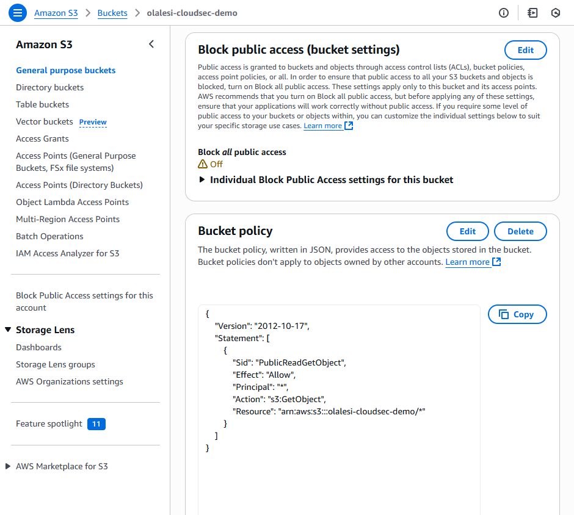
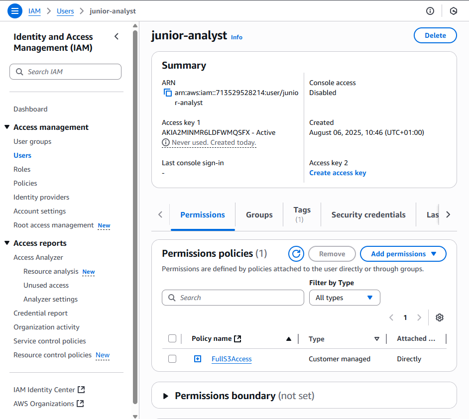
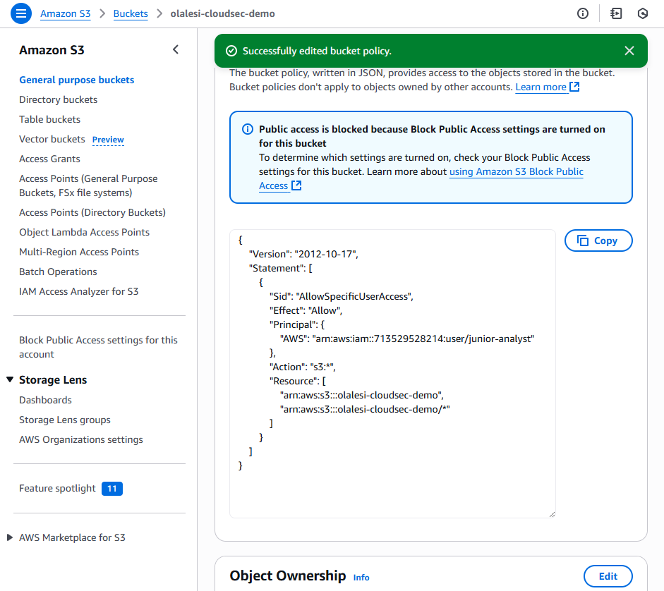
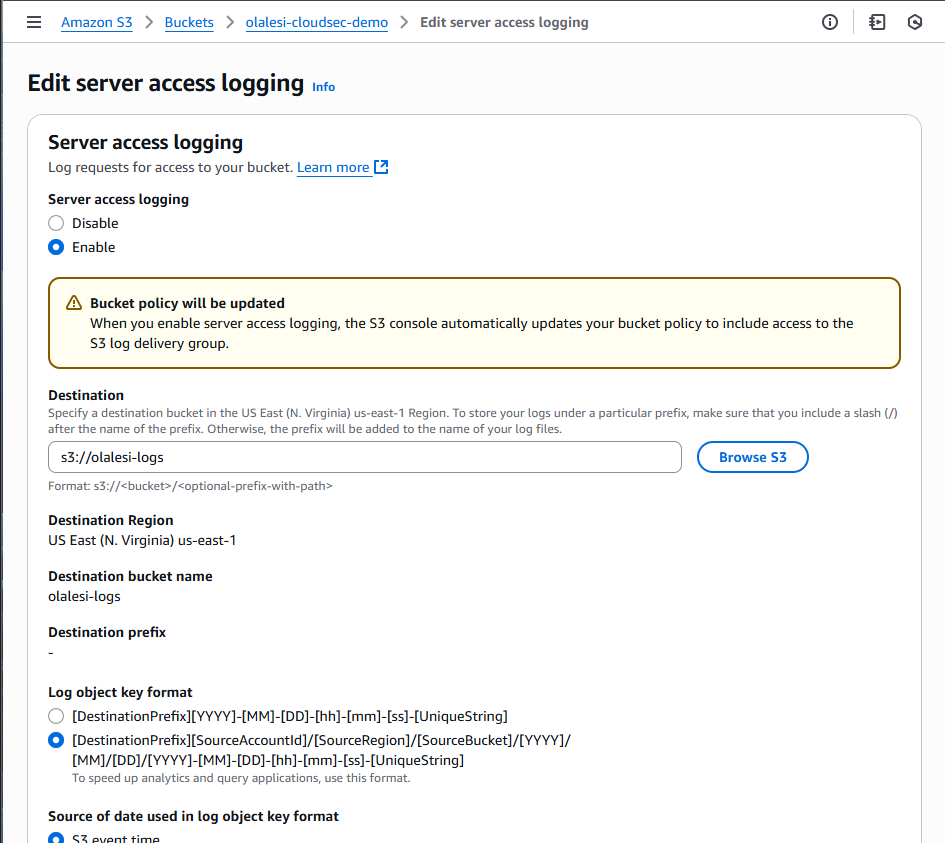
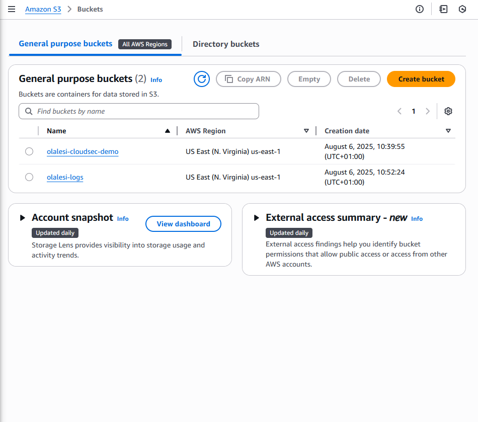

**🔐 How I Simulated and Secured an Insecure AWS S3 Bucket as a Cloud Security Beginner**

**🧩 Introduction**

Getting into cloud security can feel overwhelming at first, but one of the best ways I’ve found to learn is through hands-on experience. Recently, I worked on a hands-on project using AWS that helped me understand how simple misconfigurations in S3 buckets and IAM policies can lead to serious security risks.
 
 This is my beginner-friendly breakdown of what I built, what went wrong (on purpose), and how I fixed it using AWS security best practices.

**⚙️ Project Setup**

Tools I used:

•	AWS Management Console

•	S3 (Simple Storage Service)

•	IAM (Identity and Access Management)

•	AWS CLI (Command Line Interface)

Objective:

 Create an insecure S3 bucket to simulate a common security mistake — then lock it down properly using the principle of least privilege.

**🔓 Step 1: Simulating an Insecure S3 Bucket**

I started by creating a bucket called olalesi-cloudsec-demo.
 
 Then, I uploaded a simple file: sensitive.txt.

To simulate a common misconfiguration:

•	I disabled “Block Public Access”

•	Applied a public-read policy to the bucket

•	Tested it — and yes, the file was downloadable from the internet without any authentication.

👉 This proves how risky it is to leave S3 buckets open to the public — even by mistake.

**👤 Step 2: Creating an IAM User with Excessive Permissions**

Next, I created a new IAM user called junior-analyst and gave it full access to all S3 buckets.
 
 I connected to AWS using this user’s Access Keys via the CLI, and sure enough — the user had way too much access.

This was intentional, of course, but it highlighted how easy it is to over-permission users if you’re not careful.

**🔐 Step 3: Securing the Bucket**

Now it was time to fix the issues:

✅ I re-enabled “Block Public Access” on the bucket

 ✅ I removed the public bucket policy
 
 ✅ Then, I applied a strict IAM policy — allowing only the junior-analyst user to access the bucket, and nothing more
 
 ✅ I also enabled S3 Server Access Logging and directed the logs to a separate bucket called olalesi-logs
 
These changes significantly tightened security and followed the principle of least privilege.

📈 What I Learned

🔸 Misconfigurations are real threats — Even small mistakes can expose sensitive data

 🔸 Least privilege is essential — Only give access that’s absolutely necessary
 
 🔸 Logging matters — Monitoring and traceability help you detect and investigate issues
 
💡 Final Thoughts

This small project was a big eye-opener. It helped me understand not just how to set up AWS services, but how to secure them like a cloud professional. Seeing firsthand how a misconfigured S3 bucket can leak data — and then remediating it — gave me real confidence in cloud security fundamentals.

